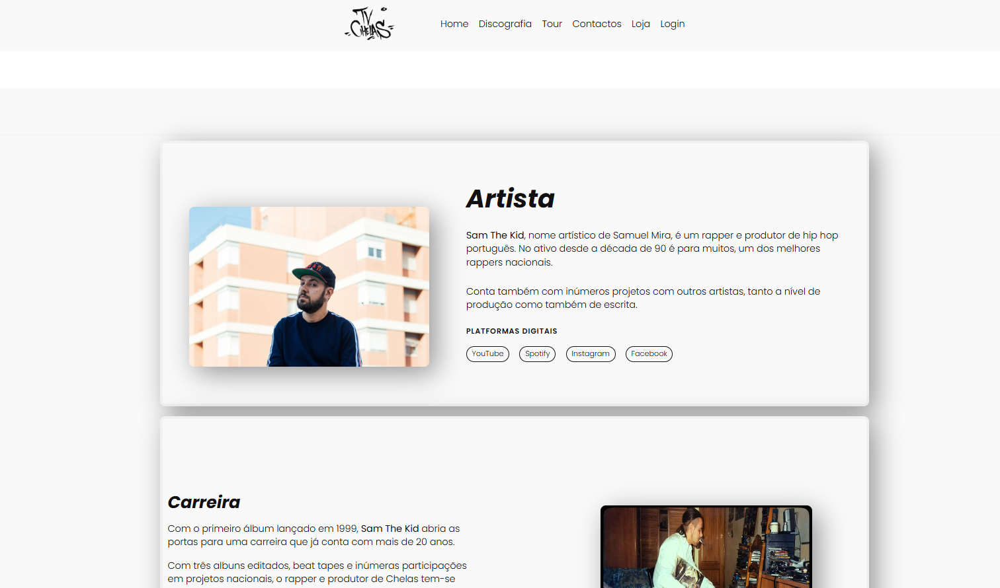
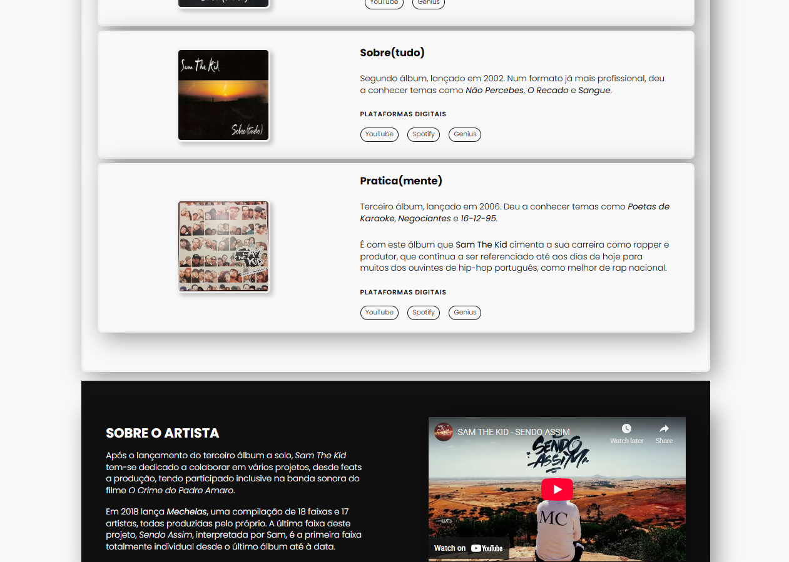
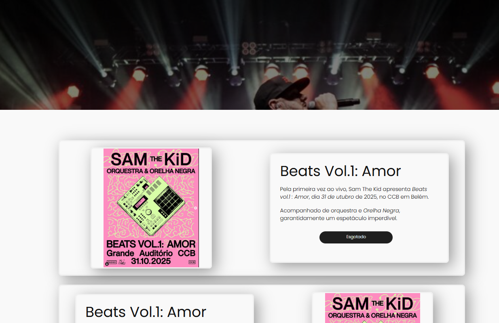
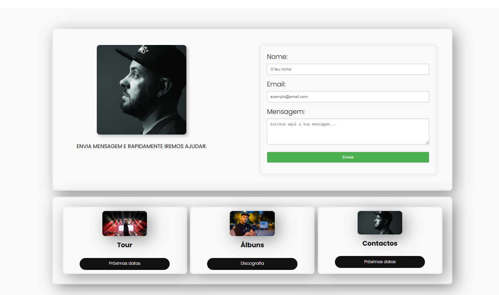
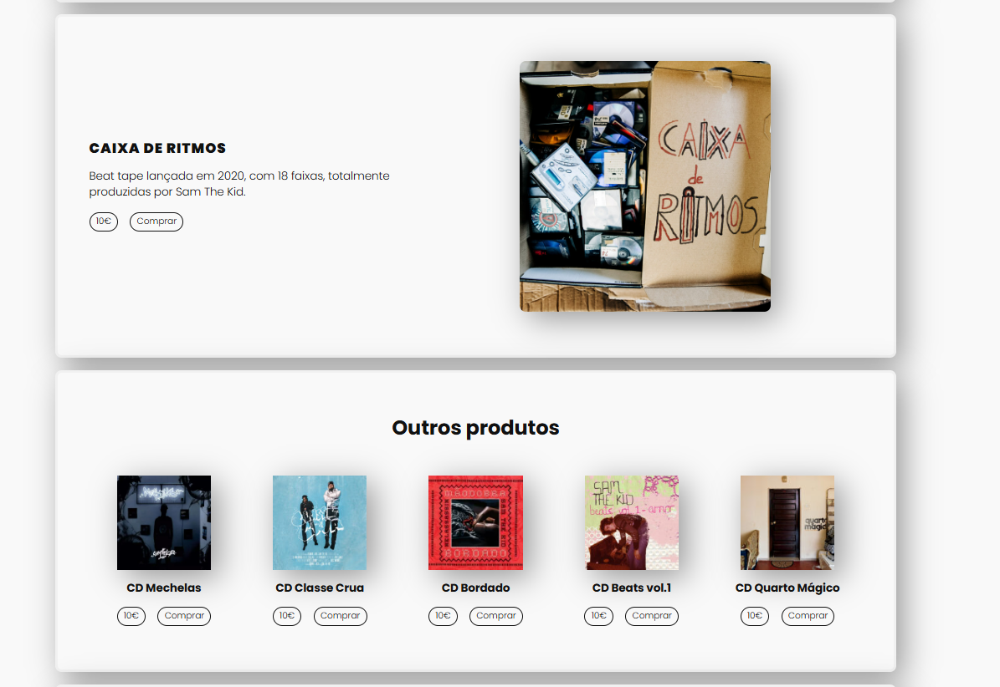
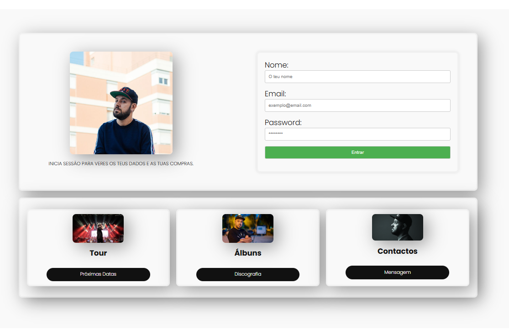

# Multi-Page WordPress Website (Built with Gutenberg)

This is a multi-page website built using **WordPress** and the **Gutenberg block editor**, developed locally with **LocalWP**. The site includes several sections such as Home, Discografia, Tour, Contactos, Loja and Login.

## 🛠️ Tech Stack

- WordPress CMS
- Gutenberg Block Editor
- LocalWP (for local development)

## 📸 Screenshots

### Home Page

### Discografia Page

### Tour Page

### Contactos Page

### Loja Page

### Login Page

## 🚀 Live Demo

👉 [View Live Site](https://your-live-site.com)  
*or include a screen recording if it’s not live*

## 📦 How to Run

This site was built using Gutenberg and contains no custom theme files. If you'd like to run it:

1. Import the included LocalWP export into your LocalWP app
2. Start the site and visit it locally

## 📁 Files Included

- `/screenshots/`: PNGs of each page
- `site-export.zip`: Optional full LocalWP export
- `README.md`: This documentation
